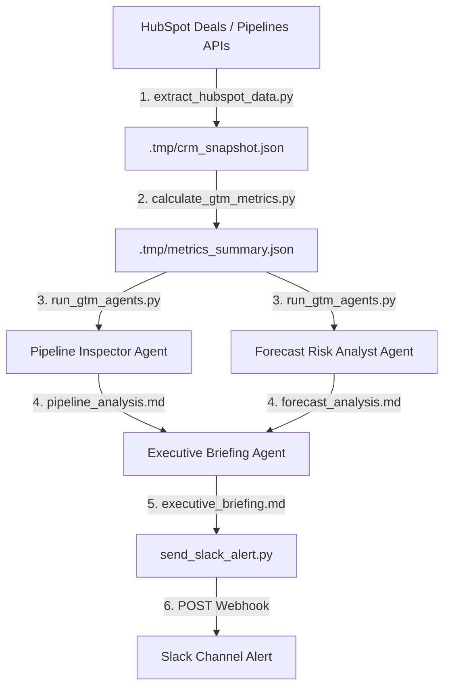

# AI GTM Revenue Intelligence Platform

An automated, revenue-first Go-To-Market (GTM) intelligence system built to analyze HubSpot CRM pipeline health, calculate core operational GTM metrics, and generate executive-ready revenue briefings.

---

# Overview

The **AI GTM Revenue Intelligence Platform** is an automated analytical layer designed to help revenue operations and sales leadership optimize their sales engine. It ingests live CRM pipeline snapshots to calculate stage velocity, sales cycle length, and pipeline coverage ratios against an ARR target. Using the calculated GTM metrics, coordinated AI agents perform bottleneck identification, forecast risk analysis, and generate C-suite ready briefings.

This platform was built to demonstrate:
- **Revenue-First GTM Engineering**: Translating raw CRM fields into exact, actionable SaaS metrics.
- **WAT Framework Architecture**: Decoupling deterministic execution (data extraction, metric calculations, and webhook notifications) from probabilistic reasoning (LLM analysis).
- **Production-Grade Automation**: Providing a fully testable, scheduled pipeline running on CI/CD with real-world integrations (HubSpot and Slack).

---

# Key Features

- **Automated CRM Data Extraction**: Ingests HubSpot Deal and Pipeline schemas dynamically (deal stages, stage win probabilities, amounts, and progression metadata).
- **Data Quality & Validation Engine**: Auto-corrects chronologically inconsistent timestamps (e.g., historical close dates preceding create dates due to sync lags) using configurable default sales cycle rules.
- **SaaS Metric Calculation Engine**: Computes exact raw and weighted pipeline coverage ratios, stage velocity metrics (average days in stage), and historical win-cycle trends.
- **Multi-Agent Coordinated Analysis**: Runs Pipeline Inspector and Forecast Risk Analyst agents, whose outputs are synthesized by an Executive Briefing Orchestrator into strategic revenue recommendations.
- **Slack Alert Dispatcher**: Formats and publishes markdown briefings directly into team Slack channels.
- **Scheduled CI/CD Run**: Configured via GitHub Actions to execute automatically every Monday morning.

---

# System Architecture

The platform follows a unidirectional pipeline where deterministic Python tools prepare and clean data for probabilistic LLM agent analysis, which then feeds downstream notification tools:



---

# AI Agents

Coordinated agents run sequentially under the control of [run_gtm_agents.py]:

### 1. Pipeline Inspector
- **Purpose**: Identifies bottlenecks, velocity anomalies, and pipeline hygiene violations.
- **Input**: `metrics_summary.json` and raw `crm_snapshot.json` deal listings.
- **Output**: Detailed bottleneck lists (friction stages, stagnant durations) and hygiene findings.
- **Business Value**: Highlights exactly where deals are stalling and where sales rep update compliance is lacking.

### 2. Forecast Risk Analyst
- **Purpose**: Assesses target ARR quota achievement risks based on pipeline coverage.
- **Input**: Raw and weighted pipeline coverage calculations compared to target ARR.
- **Output**: A categorized risk assessment (High/Medium/Low) and top revenue risk vectors.
- **Business Value**: Alerts revenue leaders of pipeline deficits early enough in the quarter to execute corrective marketing or SDR actions.

### 3. Executive Briefing Orchestrator
- **Purpose**: Synthesizes the pipeline and forecast outputs into a single, high-level C-suite brief.
- **Input**: Markdown reports from the Pipeline Inspector and Forecast Risk Analyst.
- **Output**: An executive KPI dashboard table, key risk summary, and a 30-60-90 day strategic plan.
- **Business Value**: Provides executives with an immediate, high-level health report of the revenue engine without needing manual data compiling.

---

# Repository Structure

```
.
├── .agents/
│   └── AGENTS.md                  # Workspace instructions for the agent pipeline
├── .github/workflows/
│   └── gtm_intelligence_cron.yml  # Monday morning GitHub Actions scheduler
├── config/
│   └── pipeline_config.json       # Configurable quota targets and data correction rules
├── examples/
│   └── ...                        # Anonymized sample inputs and execution outputs
├── tests/
│   ├── test_extraction.py         # Unit tests for HubSpot API mocks
│   └── test_metrics.py            # Unit tests for GTM mathematical calculations
├── tools/
│   ├── extract_hubspot_data.py    # HubSpot Deals & Pipelines data extractor
│   ├── calculate_gtm_metrics.py   # Data validation and GTM math calculation engine
│   ├── run_gtm_agents.py          # Multi-agent LLM analysis orchestrator
│   └── send_slack_alert.py        # Slack webhook notification publisher
├── workflows/
│   ├── inspect_pipeline.md        # Standard Operating Procedure (SOP) for pipeline inspection
│   ├── analyze_forecast_risk.md   # SOP for forecasting and coverage analysis
│   └── executive_briefing.md      # SOP for executive briefing compilation
├── GEMINI.md                      # Core Agent rules
└── README.md                      # Platform documentation
```

---

# Technology Stack

- **Execution Language**: Python 3.11+
- **APIs and Webhooks**: HubSpot REST API, Slack Webhook API
- **AI/LLM Libraries**: `google-generativeai` (Gemini API), `openai` (OpenAI API)
- **Utilities**: `requests` (API requests), `python-dotenv` (environment variables)
- **Unit Testing**: Python `unittest` framework
- **Automation / Orchestration**: GitHub Actions

---

# Getting Started

### 1. Installation
Clone the repository and install the dependencies:
```bash
pip install requests python-dotenv google-generativeai openai
```

### 2. Environment Configuration
Create a `.env` file in the project root containing your API credentials:
```env
# HubSpot Private App Access Token
HUBSPOT_ACCESS_TOKEN=your_hubspot_access_token

# Slack Incoming Webhook URL
SLACK_WEBHOOK_URL=your_slack_webhook_url

# LLM Provider Keys (at least one is required for agent execution)
GEMINI_API_KEY=your_gemini_api_key
OPENAI_API_KEY=your_openai_api_key
```

### 3. Running the Pipeline
Run the data extraction, metrics engine, LLM agents, and Slack notifier:
```bash
# Extract pipeline data from HubSpot (creates .tmp/crm_snapshot.json)
python tools/extract_hubspot_data.py

# Calculate GTM metrics (creates .tmp/metrics_summary.json)
python tools/calculate_gtm_metrics.py

# Run AI Agents and generate Executive Briefing (creates .tmp/executive_briefing.md)
python tools/run_gtm_agents.py

# Dispatch the briefing to Slack
python tools/send_slack_alert.py
```

### 4. Running the Tests
Verify the metrics engine and HubSpot extraction mock logic:
```bash
python -m unittest discover -s tests
```

---

# Example Data

The codebase is packaged with a simulated fallback dataset to ensure immediate offline execution. If no active API credentials are set in the `.env` file, the platform automatically enters simulation mode, generating realistic deals and stage structures (including chronological data skews to demonstrate the validation rules).

You can find anonymized samples of raw snapshots, calculated metrics, and compiled AI reports in the [examples/] directory.

---

# Future Improvements

- **Interactive UI Dashboard**: Build a lightweight dashboard to visualize stage velocity changes, trend lines, and forecast gaps over time.
- **Bi-Directional CRM Updates**: Implement write-back tools enabling the platform to auto-flag aging deals directly within HubSpot (e.g., adding a warning tag to Deals with overdue close dates).
- **Historical Cohort Analysis**: Extend metrics to compare current week-over-week velocity shifts against historical quarterly cohorts.
